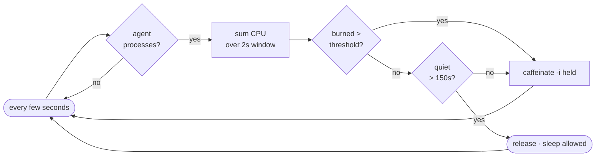

<p align="center">
  
</p>

<p align="center">
  
  
  
  
</p>

# cogwake

Your Mac sleeps on its idle timer. A coding agent that runs for ten minutes with no keypress trips that timer, and the machine suspends the task halfway through. cogwake watches the agent processes and blocks idle sleep while they burn CPU. The hold expires when the agent goes quiet, and your usual sleep settings take over.

It targets the work, not the app. An open editor or an agent parked at a prompt uses no CPU, so it never pins the Mac awake.

## How it decides

A launchd background job samples every few seconds:

1. Find the agent processes by command name (Copilot CLI, Claude, Codex, aider, and the VS Code `copilot-language-server`), plus every child they spawned.
2. Sum the CPU time that whole tree burns over a 2 second window.
3. Cross the threshold, and it asserts `caffeinate -i`.
4. Pass 150 quiet seconds, and it drops the assertion.

This binds wakefulness to real work. A build the agent started or a model streaming tokens shows up as CPU and keeps the system awake. Silence at a prompt does not.



## Install

```bash
git clone https://github.com/marcelsafin/cogwake.git && cd cogwake
./install.sh
```

`install.sh` symlinks the script into `~/.local/bin`, copies the config to `~/.config/cogwake.env`, renders the launchd plist, and loads it. The job starts at login and respawns if it dies.

## Verify

```bash
# loaded?
launchctl print gui/$(id -u)/io.github.marcelsafin.cogwake | grep -E 'state|pid'

# what has it done?
tail -f ~/Library/Logs/cogwake.log

# who blocks sleep right now?
pmset -g assertions | grep PreventUserIdleSystemSleep
```

You see a `caffeinate` assertion "asserting on behalf of" the watchdog PID while an agent works. Stop the agent, wait past the hold, and the line clears.

## Configure

Edit `~/.config/cogwake.env`:

| Knob | Default | Meaning |
|------|---------|---------|
| `AGENT_RE` | `copilot\|claude\|codex\|aider\|cursor-agent\|ollama\|gemini-cli\|continue` | command patterns that count as an agent |
| `BUSY_CPU` | `0.30` | CPU-seconds per window that count as working (≈15% of one core) |
| `HOLD` | `150` | seconds awake after the last activity |
| `WINDOW` | `2` | CPU sample window, seconds |
| `POLL` | `5` | pause between checks, seconds |

Reload after an edit:

```bash
launchctl kickstart -k gui/$(id -u)/io.github.marcelsafin.cogwake
```

## Test

```bash
bash test/selfcheck.sh   # asserts the CPU-time parser and the process-tree walk
```

## Limits

- It reads CPU. It cannot read intent. A long reasoning step with zero local CPU and no token traffic past the `HOLD` window can still let the Mac sleep. Raise `HOLD` to cover that.
- VS Code coverage rides on `copilot-language-server`. Add other editor agents to `AGENT_RE` by their process name.
- The assertion uses `caffeinate -i -w $$`, so it dies with the watchdog. A crash leaves no stuck "always awake" state.
- This blocks idle sleep only. It leaves lid-close, `pmset sleepnow`, and low-battery sleep alone.

## Uninstall

```bash
./uninstall.sh
```

This removes the launchd job and the symlink. Your config and logs stay.

## License

MIT. See [LICENSE](LICENSE).
