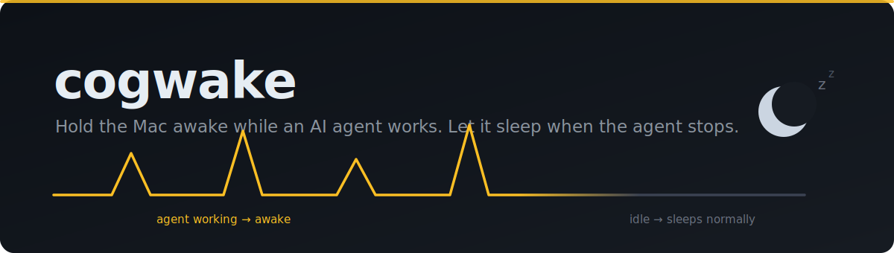
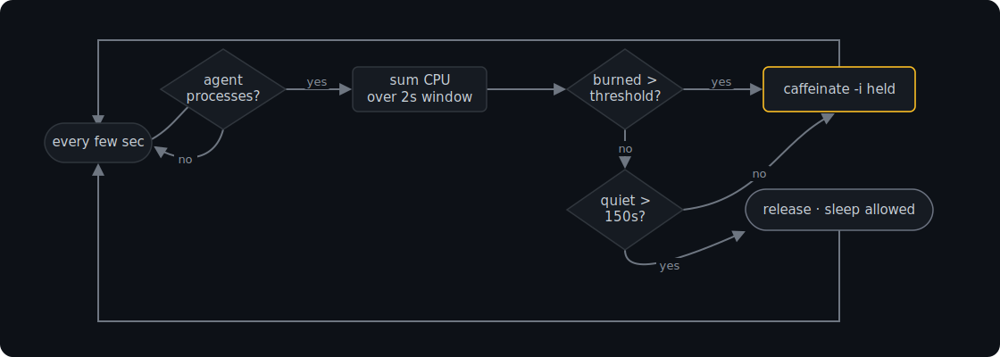

<p align="center">
  
</p>

<p align="center">
  
  
  
  
</p>

# cogwake

You close the laptop to catch your train. An agent was mid-task. On battery, macOS clamshell-sleep suspends it within a second or two, and the phone tether drops with it. cogwake holds the Mac awake while an agent burns CPU, keeps running when you close the lid, and lets the Mac sleep about 30 seconds after the agent goes quiet.

It targets the work, not the app. An agent parked at a prompt uses no CPU, so the Mac sleeps on its normal timer.

## Why it needs root

`caffeinate` blocks idle sleep but not a lid close on battery. `caffeinate -s` holds only on AC power. The one switch that survives clamshell on battery is `pmset disablesleep`, and that needs root. cogwake runs as a root LaunchDaemon and flips that switch for you.

## How it decides

A LaunchDaemon samples every few seconds:

1. Find the agent processes by command name (Copilot CLI, Claude, Codex, aider, and the VS Code `copilot-language-server`), plus every child they spawned.
2. Sum the CPU that whole tree burns over a 2 second window.
3. Past the threshold, set `disablesleep=1`.
4. After 30 quiet seconds, set it back to 0. With the lid shut that sleeps the Mac within a few seconds of the agent finishing.

<p align="center">
  
</p>

### Winning the lid-close race

The kernel checks `disablesleep` at the instant the lid shuts. A 5 second poll cannot set it after the fact. The Mac is already asleep. So cogwake pre-arms: while the agent is active it holds `disablesleep=1` even with the lid open, so closing the lid mid-task keeps the work running and the tether up. Thirty quiet seconds drops the flag.

### Battery: runs until it dies

By default cogwake keeps working on battery with no charge floor. Set `BATT_FLOOR` to a percent (say 15) if you want it to stop and sleep before the battery runs out. Off by default because the thermal valve guards the real bag risk.

### Thermal valve

A closed laptop in a bag has no airflow, so heat is the danger, not charge. With the lid shut, cogwake samples macOS thermal pressure. At a serious level (`THERM_RE`, default `heavy|trapping|sleeping|serious|critical`) it releases the override and lets the Mac sleep to cool, even mid-task. Your work pauses with the process frozen, not killed, and resumes when you open the lid. Normal load that only warms the Mac (moderate or fair pressure) keeps running.

## Install

```bash
git clone https://github.com/marcelsafin/cogwake.git && cd cogwake
sudo ./install.sh
```

`install.sh` copies the script to `/usr/local/bin`, the config to `/usr/local/etc/cogwake.env`, renders the LaunchDaemon plist into `/Library/LaunchDaemons`, and loads it in the system domain. It starts at boot and respawns if it dies.

## Verify

```bash
# loaded?
sudo launchctl print system/io.github.marcelsafin.cogwake | grep -E 'state|pid'

# what has it done?
tail -f /var/log/cogwake.log

# is sleep disabled right now?
pmset -g | grep SleepDisabled
```

While an agent works you see `SleepDisabled 1`. Stop the agent, wait past the hold, and it reads `0` again.

## Configure

Edit `/usr/local/etc/cogwake.env`:

| Knob | Default | Meaning |
|------|---------|---------|
| `AGENT_RE` | `copilot\|claude\|codex\|aider\|cursor-agent\|ollama\|gemini-cli\|continue` | command patterns that count as an agent |
| `BUSY_CPU` | `0.30` | CPU-seconds per window that count as working (≈15% of one core) |
| `HOLD` | `30` | seconds awake after the last activity |
| `BATT_FLOOR` | `0` | on battery, release below this % (`0` = run till it dies) |
| `THERM_GUARD` | `1` | with the lid shut, sleep on serious thermal pressure |
| `THERM_RE` | `heavy\|trapping\|sleeping\|serious\|critical` | pressure levels that count as too hot |
| `WINDOW` | `2` | CPU sample window, seconds |
| `POLL` | `5` | pause between checks, seconds |

Reload after an edit:

```bash
sudo launchctl kickstart -k system/io.github.marcelsafin.cogwake
```

## Test

```bash
bash test/selfcheck.sh   # CPU-time parser, process-tree walk, lid + battery probes
```

## Limits

- It reads CPU, not intent. A long remote reasoning step with no local CPU and no token traffic past `HOLD` can still let the Mac sleep. Raise `HOLD` to cover that.
- `disablesleep=1` keeps the display awake too while an agent runs. macOS has no clamshell-only hold on battery.
- The thermal valve reads macOS thermal pressure, which needs root (no temp sysctl on Apple Silicon). It samples only while the lid is shut. Check the log for the level your Mac reports and tune `THERM_RE`.
- The daemon resets `disablesleep` to `0` on exit, and again at its next start, so a crash leaves no stuck always-awake state.
- VS Code coverage rides on `copilot-language-server`. Add other editor agents to `AGENT_RE` by process name.

## Uninstall

```bash
sudo ./uninstall.sh
```

This removes the LaunchDaemon, resets `disablesleep` to `0`, and keeps your config and logs.

## License

MIT. See [LICENSE](LICENSE).
